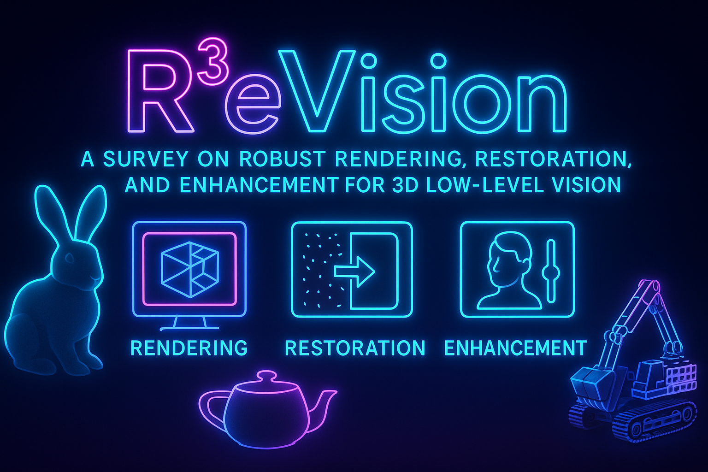
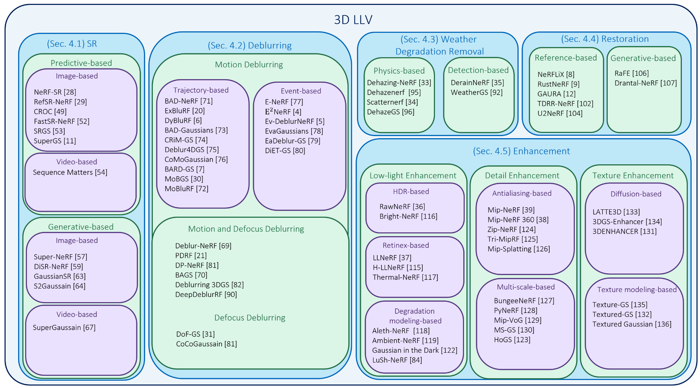

# Awesome-3D-Low Level Vision
###   R<sup>3</sup>eVision: A Survey on Robust Rendering, Restoration, and Enhancement for 3D Low-Level Vision

<p align="center">
  
</p>


[](https://github.com/sindresorhus/awesome)
[](https://github.com/CMLab-Korea/Awesome-3D-Low-Level-Vision)
[](https://arxiv.org/abs/2506.16262)
[](https://github.com/CMLab-Korea/Awesome-3D-Low-Level-Vision/stargazers)

This repository provides a curated collection of papers, benchmarks, and resources from our survey:  
**"R<sup>3</sup>eVision: A Survey on Robust Rendering, Restoration, and Enhancement for 3D Low-Level Vision"** (arXiv2025).

> 📝 **Authors**: Weeyoung Kwon<sup>1</sup>, Jeahun Sung<sup>2</sup>, Minkyu Jeon<sup>3</sup>, Chanho Eom<sup>1</sup>, and Jihyong Oh<sup>2†</sup>

> 🎓 **Institution**: </br>
> * <sup>1</sup> Department of Metaverse Convergence, GSAIM, **Chung-Ang University** </br>
> * <sup>2</sup> Department of Imaging Science, GSAIM, **Chung-Ang University** </br>
> * <sup>3</sup> Department of Computer Science, **Princeton University**

---

## 📘 Abstract

Neural rendering methods such as Neural Radiance Fields (NeRF) and 3D Gaussian Splatting (3DGS) have achieved significant progress in photorealistic 3D scene reconstruction and novel view synthesis. However, most existing models assume clean and high-resolution (HR) multi-view inputs, which limits their robustness under real-world degradations such as noise, blur, low-resolution (LR), and weather-induced artifacts. To address these limitations, the emerging field of 3D Low-Level Vision (3D LLV) extends classical 2D Low-Level Vision tasks including super-resolution (SR), deblurring, weather degradation removal, restoration, and enhancement into the 3D spatial domain. This survey, referred to as R3eVision, provides a comprehensive overview of robust rendering, restoration, and enhancement for 3D LLV by formalizing the degradation-aware rendering problem and identifying key challenges related to spatio-temporal consistency and ill-posed optimization. Recent methods that integrate LLV into neural rendering frameworks are categorized to illustrate how they enable high-fidelity 3D reconstruction under adverse conditions. Application domains such as autonomous driving, AR/VR, and robotics are also discussed, where reliable 3D perception from degraded inputs is critical. By reviewing representative methods, datasets, and evaluation protocols, this work positions 3D LLV as a fundamental direction for robust 3D content generation and scene-level reconstruction in real-world environments. We maintain an up-to-date project page: https://github.com/CMLab-Korea/Awesome-3D-Low-Level-Vision.


---

## 📚 Contents

- [📣 News](#-news)
- [🔖 Citation](#-citation)
- [🔍 Survey Paper](#-survey-paper)
- [📄 Paper List](#-paper-list)
- [📊 Experimental Setup](#-experimental--setup)

---

## 📣 News

- 📌 2025-06: Paper released to ArXiv.
- 🚀 2025-05: Repository initialized.

---

## 🔖 Citation

If you find this survey helpful, please consider citing us:

```citation
@article{Kwon2025R3eVision,
  title={R3eVision: A Survey on Robust Rendering, Restoration, and Enhancement for 3D Low-Level Vision},
  author={Kwon, Weeyoung and Sung, Jeahun and Jeon, Minkyu and Eom, Chanho and Oh, Jihyong},
  journal={arXiv preprint arXiv:2506.01061},
  year={2025}
}
```
---

## 🧩 Community Contribution

We welcome contributions from the 3D LLV research community!

If you have a new method, dataset, or related resource that fits within the scope of this 3D LLV repository, please feel free to submit a pull request (PR) with the following:

A brief description of your method/resource

Relevant links (e.g., arXiv, project page, code)

Suggested placement (e.g., under “4.2. Deblurring in 3D LLV”)

Our maintainers will review your submission and merge it if appropriate. We hope this page will grow into a collaborative hub for 3D Low-Level Vision (3D LLV) research, covering topics such as degradation-aware rendering, neural field restoration, and robust 3D reconstruction under real-world conditions.

---

## 🔍 Survey Paper

You can find the preprint of our survey here:  
📄 [arXiv:2506.16262](https://arxiv.org/abs/2506.16262)


The overview of our survey paper:


---

## 📄 Paper List

We categorize recent 3D-LLV papers by methodology:  


## 4.Low-Level Vision For Robust 3D Rendering

### 4.1. Super-Resolution (SR) in 3D LLV
### 4.1.1. Predictive Method

<table>
<thead>
<tr>
<th align="left">Title</th>
<th align="center">Publication</th>
<th align="center">Date</th>
<th align="center">Tags</th>
</tr>
</thead>
<tbody>
<tr>
  <td align="left">
    <a href="https://dl.acm.org/doi/abs/10.1145/3503161.3547808">
      Multi-task View Synthesis with Neural Radiance Fields
    </a>
  </td>
  <td align="center">ACM MM</td>
  <td align="center">2022</td>
<td align="center">Image-based</td>
</tr>
<tr>
  <td align="left">
    <a href="https://openaccess.thecvf.com/content/CVPR2023/html/Huang_RefSR-NeRF_Towards_High_Fidelity_and_Super_Resolution_View_Synthesis_CVPR_2023_paper.html">
      RefSR-NeRF: Towards High Fidelity and Super Resolution View Synthesis
    </a>
  </td>
  <td align="center">CVPR</td>
  <td align="center">2023</td>
<td align="center">Image-based</td>
</tr>
<tr>
  <td align="left">
    <a href="https://openaccess.thecvf.com/content/CVPR2023/html/Yoon_Cross-Guided_Optimization_of_Radiance_Fields_With_Multi-View_Image_Super-Resolution_for_CVPR_2023_paper.html">
      Cross-Guided Optimization of Radiance Fields With Multi-View Image Super-Resolution for High-Resolution Novel View Synthesis
    </a>
  </td>
  <td align="center">CVPR</td>
  <td align="center">2023</td>
<td align="center">Image-based</td>
</tr>
</tr>
<tr>
  <td align="left">
    <a href="https://arxiv.org/abs/2312.12122">
      ZS-SRT: An Efficient Zero-Shot Super-Resolution Training Method for Neural Radiance Fields
    </a>
  </td>
  <td align="center">arXiv</td>
  <td align="center">2023</td>
<td align="center">Image-based</td>
</tr>  
<tr>
  <td align="left">
    <a href="https://openaccess.thecvf.com/content/WACV2024/html/Lin_FastSR-NeRF_Improving_NeRF_Efficiency_on_Consumer_Devices_With_a_Simple_WACV_2024_paper.html">
      FastSR-NeRF: Improving NeRF Efficiency on Consumer Devices With a Simple Super-Resolution Pipeline
    </a>
  </td>
  <td align="center">WACV</td>
  <td align="center">2024</td>
<td align="center">Image-based</td>
</tr>
<tr>
  <td align="left">
    <a href="https://arxiv.org/abs/2404.10318">
      SRGS: Super-Resolution 3D Gaussian Splatting
    </a>
  </td>
  <td align="center">arXiv</td>
  <td align="center">2024</td>
<td align="center">Image-based</td>
</tr>
<tr>
  <td align="left">
    <a href="https://arxiv.org/abs/2410.02571">
      SuperGS: Super-Resolution 3D Gaussian Splatting Enhanced by Variational Residual Features and Uncertainty-Augmented Learning
    </a>
  </td>
  <td align="center">arXiv</td>
  <td align="center">2024</td>
<td align="center">Image-based</td>
</tr>
  
<tr>
  <td align="left">
    <a href="https://arxiv.org/pdf/2511.22233">
      IE-SRGS: An Internal-External Knowledge Fusion Framework for High-Fidelity 3D Gaussian Splatting Super-Resolution
    </a>
  </td>
  <td align="center">AAAI</td>
  <td align="center">2026</td>
<td align="center">Image-based</td>
</tr>

<tr>
  <td align="left">
    <a href="https://arxiv.org/pdf/2512.02172">
      SplatSuRe: Selective Super-Resolution for Multi-view Consistent 3D Gaussian Splatting
    </a>
  </td>
  <td align="center">arXiv</td>
  <td align="center">2025</td>
<td align="center">Image-based</td>
</tr>

<tr>
  <td align="left">
    <a href="https://arxiv.org/pdf/2512.15048">
      MVGSR: Multi-View Consistent 3D Gaussian SR via Epipolar Guidance
    </a>
  </td>
  <td align="center">arXiv</td>
  <td align="center">2025</td>
<td align="center">Image-based</td>
</tr>

<tr>
  <td align="left">
    <a href="https://ojs.aaai.org/index.php/AAAI/article/view/32458">
      Sequence Matters: Harnessing Video Models in 3D Super-Resolution
    </a>
  </td>
  <td align="center">AAAI</td>
  <td align="center">2024</td>
<td align="center">Video-based</td>
</tr>

</tr>
</tbody>
</table>

### 4.1.2. Generative-based
<table>
<thead>
<tr>
<th align="left">Title</th>
<th align="center">Publication</th>
<th align="center">Date</th>
<th align="center">Tags</th>
</tr>
</thead>
<tbody>

<tr>
  <td align="left">
    <a href="https://ieeexplore.ieee.org/abstract/document/10742507">
      Super-NeRF: View-consistent Detail Generation for NeRF Super-resolution
    </a>
  </td>
  <td align="center">TVCG</td>
  <td align="center">2024</td>
<td align="center">Image-based</td>
</tr>
<tr>
  <td align="left">
    <a href="https://openaccess.thecvf.com/content/CVPR2024/html/Lee_DiSR-NeRF_Diffusion-Guided_View-Consistent_Super-Resolution_NeRF_CVPR_2024_paper.html">
      DiSR-NeRF: Diffusion-Guided View-Consistent Super-Resolution NeRF
    </a>
  </td>
  <td align="center">CVPR</td>
  <td align="center">2024</td>
  <td align="center">Image-based</td>
</tr>
<tr>
  <td align="left">
    <a href="https://arxiv.org/abs/2406.10111">
      GaussianSR: 3D Gaussian Super-Resolution with 2D Diffusion Priors
    </a>
  </td>
  <td align="center">arXiv</td>
  <td align="center">2024</td>
  <td align="center">Image-based</td>
</tr>
<tr>
  <td align="left">
    <a href="https://openaccess.thecvf.com/content/CVPR2025/html/Wan_S2Gaussian_Sparse-View_Super-Resolution_3D_Gaussian_Splatting_CVPR_2025_paper.html">
      S2Gaussian: Sparse-View Super-Resolution 3D Gaussian Splatting
    </a>
  </td>
  <td align="center">CVPR</td>
  <td align="center">2025</td>
  <td align="center">Image-based</td>
</tr>
<tr>
  <td align="left">
      <a href="https://arxiv.org/pdf/2508.04090">
        Bridging Diffusion Models and 3D Representations: A 3D Consistent Super-Resolution Framework
      </a>
  </td>
  <td align="center">ICCV</td>
  <td align="center">2025</td>
  <td align="center">Image-based</td>
</tr>
<tr>
  <td align="left">
    <a href="https://arxiv.org/pdf/2406.00609">
      SuperGaussian: Repurposing Video Models for 3D Super Resolution
    </a>
  </td>
  <td align="center">ECCV</td>
  <td align="center">2024</td>
  <td align="center">Video-based</td>
</tr>
</tbody>
</table>


### 4.2. Deblurring in 3D LLV
### 4.2.1. Motion Deblurring
<table>
<thead>
<tr>
<th align="left">Title</th>
<th align="center">Publication</th>
<th align="center">Date</th>
<th align="center">Tags</th>
</tr>
</thead>
<tbody>

<tr>
  <td align="left">
    <a href="https://openaccess.thecvf.com/content/CVPR2023/html/Wang_BAD-NeRF_Bundle_Adjusted_Deblur_Neural_Radiance_Fields_CVPR_2023_paper.html">
      BAD-NeRF: Bundle Adjusted Deblur Neural Radiance Fields
    </a>
  </td>
  <td align="center">CVPR</td>
  <td align="center">2023</td>
  <td align="center">Trajectory-based</td>
</tr>
<tr>
  <td align="left">
    <a href="https://openaccess.thecvf.com/content/ICCV2023/html/Lee_ExBluRF_Efficient_Radiance_Fields_for_Extreme_Motion_Blurred_Images_ICCV_2023_paper.html">
      ExBluRF: Efficient Radiance Fields for Extreme Motion Blurred Images
    </a>
  </td>
  <td align="center">ICCV</td>
  <td align="center">2023</td>
  <td align="center">Trajectory-based</td>
</tr>
<tr>
  <td align="left">
    <a href="https://openaccess.thecvf.com/content/CVPR2024/html/Sun_DyBluRF_Dynamic_Neural_Radiance_Fields_from_Blurry_Monocular_Video_CVPR_2024_paper.html">
      DyBluRF: Dynamic Neural Radiance Fields from Blurry Monocular Video
    </a>
  </td>
  <td align="center">CVPR</td>
  <td align="center">2024</td>
  <td align="center">Trajectory-based</td>
</tr>
<tr>
  <td align="left">
    <a href="https://arxiv.org/abs/2407.03923">
      CRiM-GS: Continuous Rigid Motion-Aware Gaussian Splatting from Motion-Blurred Images
    </a>
  </td>
  <td align="center">arXiv</td>
  <td align="center">2024</td>
  <td align="center">Trajectory-based</td>
</tr>
<tr>
  <td align="left">
    <a href="https://arxiv.org/abs/2412.06424">
      Deblur4DGS: 4D Gaussian Splatting from Blurry Monocular Video
    </a>
  </td>
  <td align="center">arXiv</td>
  <td align="center">2024</td>
  <td align="center">Trajectory-based</td>
</tr>
<tr>
  <td align="left">
    <a href="https://arxiv.org/abs/2503.05332">
      CoMoGaussian: Continuous Motion-Aware Gaussian Splatting from Motion-Blurred Images
    </a>
  </td>
  <td align="center">arXiv</td>
  <td align="center">2025</td>
  <td align="center">Trajectory-based</td>
</tr>
<tr>
  <td align="left">
    <a href="https://openaccess.thecvf.com/content/CVPR2025/html/Lu_BARD-GS_Blur-Aware_Reconstruction_of_Dynamic_Scenes_via_Gaussian_Splatting_CVPR_2025_paper.html">
      BARD-GS: Blur-Aware Reconstruction of Dynamic Scenes via Gaussian Splatting
    </a>
  </td>
  <td align="center">CVPR</td>
  <td align="center">2025</td>
  <td align="center">Trajectory-based</td>
</tr>
<tr>
  <td align="left">
    <a href="https://arxiv.org/abs/2504.15122">
      MoBGS: Motion Trajectory-based Dynamic 3D Gaussian Splatting for Blurry Monocular Video
    </a>
  </td>
  <td align="center">arXiv</td>
  <td align="center">2025</td>
  <td align="center">Trajectory-based</td>
</tr>
<tr>
  <td align="left">
    <a href="https://ieeexplore.ieee.org/abstract/document/11017407">
      MoBluRF: Motion Trajectory-based Neural Radiance Fields for Blurry Monocular Video
    </a>
  </td>
  <td align="center">TPAMI</td>
  <td align="center">2025</td>
  <td align="center">Trajectory-based</td>
</tr>
<tr>
  <td align="left">
    <a href="https://ieeexplore.ieee.org/abstract/document/10028738">
      E-NeRF: Neural Radiance Fields From a Moving Event Camera
    </a>
  </td>
  <td align="center">IEEE RAL</td>
  <td align="center">2023</td>
  <td align="center">Event-based</td>
</tr>

<tr>
  <td align="left">
    <a href="https://openaccess.thecvf.com/content/ICCV2023/html/Qi_E2NeRF_Event_Enhanced_Neural_Radiance_Fields_from_Blurry_Images_ICCV_2023_paper.html">
      E2NeRF: Event Enhanced Neural Radiance Fields from Blurry Images
    </a>
  </td>
  <td align="center">ICCV</td>
  <td align="center">2023</td>
  <td align="center">Event-based</td>
</tr>
<tr>
  <td align="left">
    <a href="https://openaccess.thecvf.com/content/CVPR2024/html/Cannici_Mitigating_Motion_Blur_in_Neural_Radiance_Fields_with_Events_and_CVPR_2024_paper.html">
      Mitigating Motion Blur in Neural Radiance Fields with Events and Frames
    </a>
  </td>
  <td align="center">CVPR</td>
  <td align="center">2024</td>
  <td align="center">Event-based</td>
</tr>
<tr>
  <td align="left">
    <a href="https://arxiv.org/abs/2405.20224">
      EvaGaussians: Event Stream Assisted Gaussian Splatting from Blurry Images
    </a>
  </td>
  <td align="center">arXiv</td>
  <td align="center">2024</td>
  <td align="center">Event-based</td>
</tr>
<tr>
  <td align="left">
    <a href="https://arxiv.org/abs/2407.13520">
      EaDeblur-GS: Event assisted 3D Deblur Reconstruction with Gaussian Splatting
    </a>
  </td>
  <td align="center">arXiv</td>
  <td align="center">2024</td>
  <td align="center">Event-based</td>
</tr>
<tr>
  <td align="left">
    <a href="https://openaccess.thecvf.com/content/CVPR2025/html/Lee_DiET-GS_Diffusion_Prior_and_Event_Stream-Assisted_Motion_Deblurring_3D_Gaussian_CVPR_2025_paper.html">
      DiET-GS: Diffusion Prior and Event Stream-Assisted Motion Deblurring 3D Gaussian Splatting
    </a>
  </td>
  <td align="center">CVPR</td>
  <td align="center">2025</td>
  <td align="center">Event-based</td>
</tr>

</tbody>
</table>

### 4.2.2. Motion and Defocus Deblurring
<table>
<thead>
<tr>
<th align="left">Title</th>
<th align="center">Publication</th>
<th align="center">Date</th>
<th align="center">Tags</th>

</tr>
</thead>
<tbody>

<tr>
  <td align="left">
    <a href="https://openaccess.thecvf.com/content/CVPR2022/html/Ma_Deblur-NeRF_Neural_Radiance_Fields_From_Blurry_Images_CVPR_2022_paper.html">
      Deblur-NeRF: Neural Radiance Fields From Blurry Images
    </a>
  </td>
  <td align="center">CVPR</td>
  <td align="center">2022</td>
  <td align="center">Motion & Defocus</td>
</tr>
<tr>
  <td align="left">
    <a href="https://arxiv.org/abs/2208.08049">
      PDRF: Progressively Deblurring Radiance Field for Fast and Robust Scene Reconstruction from Blurry Images
    </a>
  </td>
  <td align="center">arXiv</td>
  <td align="center">2022</td>
  <td align="center">Motion & Defocus</td>
</tr>
<tr>
  <td align="left">
    <a href="https://openaccess.thecvf.com/content/CVPR2023/html/Lee_DP-NeRF_Deblurred_Neural_Radiance_Field_With_Physical_Scene_Priors_CVPR_2023_paper.html">
      DP-NeRF: Deblurred Neural Radiance Field With Physical Scene Priors
    </a>
  </td>
  <td align="center">CVPR</td>
  <td align="center">2023</td>
  <td align="center">Motion & Defocus</td>
</tr>
<tr>
  <td align="left">
    <a href="https://link.springer.com/chapter/10.1007/978-3-031-72989-8_17">
      BAGS: Blur Agnostic Gaussian Splatting Through Multi-scale Kernel Modeling
    </a>
  </td>
  <td align="center">ECCV</td>
  <td align="center">2024</td>
  <td align="center">Motion & Defocus</td>
</tr>
<tr>
  <td align="left">
    <a href="https://www.ecva.net/papers/eccv_2024/papers_ECCV/papers/07539.pdf">
      Deblurring 3D Gaussian Splatting
    </a>
  </td>
  <td align="center">ECCV</td>
  <td align="center">2024</td>
  <td align="center">Motion & Defocus</td>
</tr>
<tr>
  <td align="left">
    <a href="https://openaccess.thecvf.com/content/CVPR2025/html/Choi_Exploiting_Deblurring_Networks_for_Radiance_Fields_CVPR_2025_paper.html">
      Exploiting Deblurring Networks for Radiance Fields
    </a>
  </td>
  <td align="center">CVPR</td>
  <td align="center">2025</td>
  <td align="center">Motion & Defocus</td>
</tr>
<tr>
  <td align="left">
    <a href="https://openaccess.thecvf.com/content/CVPR2025/papers/Kumar_DynaMoDe-NeRF_Motion-aware_Deblurring_Neural_Radiance_Field_for_Dynamic_Scenes_CVPR_2025_paper.pdf">
      DynaMoDe-NeRF: Motion-aware Deblurring Neural Radiance Field for Dynamic Scenes
    </a>
  </td>
  <td align="center">CVPR</td>
  <td align="center">2025</td>
  <td align="center">Motion & Defocus</td>
</tr>
<tr>
  <td align="left">
    <a href="https://arxiv.org/pdf/2510.10691">
      Dynamic Gaussian Splatting from Defocused and Motion-blurred Monocular Videos
    </a>
  </td>
  <td align="center">NeurIPS</td>
  <td align="center">2025</td>
  <td align="center">Motion & Defocus</td>
</tr>
<tr>
  <td align="left">
    <a href="https://arxiv.org/abs/2405.17351">
      DOF-GS: Adjustable Depth-of-Field 3D Gaussian Splatting for Post-Capture Refocusing, Defocus Rendering and Blur Removal
    </a>
  </td>
  <td align="center">arXiv</td>
  <td align="center">2024</td>
  <td align="center">Defocus</td>
</tr>
<tr>
  <td align="left">
    <a href="https://openaccess.thecvf.com/content/CVPR2025/html/Lee_CoCoGaussian_Leveraging_Circle_of_Confusion_for_Gaussian_Splatting_from_Defocused_CVPR_2025_paper.html">
      CoCoGaussian: Leveraging Circle of Confusion for Gaussian Splatting from Defocused Images
    </a>
  </td>
  <td align="center">CVPR</td>
  <td align="center">2025</td>
  <td align="center">Defocus</td>
</tr>


</tbody>
</table>


### 4.3. Weather Degradation Removal on 3D LLV
### 4.3.1. Pysics-based
<table>
<thead>
<tr>
<th align="left">Title</th>
<th align="center">Publication</th>
<th align="center">Date</th>
<th align="center">Tags</th>
</tr>
</thead>
<tbody>

<tr>
  <td align="left">
    <a href="https://ieeexplore.ieee.org/abstract/document/10550844">
      DehazeNeRF: Multi-image Haze Removal and 3D Shape Reconstruction using Neural Radiance Fields
    </a>
  </td>
  <td align="center">3DV</td>
  <td align="center">2024</td>
  <td align="center">-</td>
</tr>
<tr>
  <td align="left">
    <a href="https://arxiv.org/abs/2304.11448">
      Dehazing-NeRF: Neural Radiance Fields from Hazy Images
    </a>
  </td>
  <td align="center">arXiv</td>
  <td align="center">2023</td>
  <td align="center">-</td>
</tr>
<tr>
  <td align="left">
    <a href="https://openaccess.thecvf.com/content/ICCV2023/html/Ramazzina_ScatterNeRF_Seeing_Through_Fog_with_Physically-Based_Inverse_Neural_Rendering_ICCV_2023_paper.html">
      ScatterNeRF: Seeing Through Fog with Physically-Based Inverse Neural Rendering
    </a>
  </td>
  <td align="center">ICCV</td>
  <td align="center">2023</td>
  <td align="center">-</td>
</tr>
<tr>
  <td align="left">
    <a href="https://arxiv.org/abs/2501.03659">
      DehazeGS: Seeing Through Fog with 3D Gaussian Splatting
    </a>
  </td>
  <td align="center">arXiv</td>
  <td align="center">2025</td>
  <td align="center">-</td>
</tr>
<tr>
  <td align="left">
    <a href="https://arxiv.org/abs/2510.22161">
      I2-NeRF: Learning Neural Radiance Fields Under Physically-Grounded Media Interactions
    </a>
  </td>
  <td align="center">NeurIPS</td>
  <td align="center">2025</td>
  <td align="center">-</td>   
</tr>


</tbody>
</table>

### 4.3.2. Detection-based
<table>
<thead>
<tr>
<th align="left">Title</th>
<th align="center">Publication</th>
<th align="center">Date</th>
<th align="center">Tags</th>
</tr>
</thead>
<tbody>
<tr>
  <td align="left">
    <a href="https://ieeexplore.ieee.org/abstract/document/10609981">
      DerainNeRF: 3D Scene Estimation with Adhesive Waterdrop Removal
    </a>
  </td>
  <td align="center">ICRA</td>
  <td align="center">2024</td>
  <td align="center">-</td>
</tr>

<tr>
  <td align="left">
    <a href="https://arxiv.org/abs/2412.18862">
      WeatherGS: 3D Scene Reconstruction in Adverse Weather Conditions via Gaussian Splatting
    </a>
  </td>
  <td align="center">arXiv</td>
  <td align="center">2024</td>
  <td align="center">-</td>
</tr>

<tr>
  <td align="left">
    <a href="https://ojs.aaai.org/index.php/AAAI/article/view/32592">
      DeRainGS: Gaussian Splatting for Enhanced Scene Reconstruction in Rainy Environments
    </a>
  </td>
  <td align="center">AAAI</td>
  <td align="center">2025</td>
  <td align="center">-</td>
</tr>

</tbody>
</table>

## 4.4. Restoration
### 4.4.1. Reference-based
<table>
<thead>
<tr>
<th align="left">Title</th>
<th align="center">Publication</th>
<th align="center">Date</th>
<th align="center">Tags</th>
</tr>
</thead>
<tbody>

<tr>
  <td align="left">
    <a href="https://openaccess.thecvf.com/content/CVPR2023/html/Zhou_NeRFLix_High-Quality_Neural_View_Synthesis_by_Learning_a_Degradation-Driven_Inter-Viewpoint_CVPR_2023_paper.html">
      NeRFLiX: High-Quality Neural View Synthesis by Learning a Degradation-Driven Inter-Viewpoint MiXer
    </a>
  </td>
  <td align="center">CVPR</td>
  <td align="center">2023</td>
  <td align="center">-</td>
</tr>
<tr>
  <td align="left">
    <a href="https://arxiv.org/abs/2401.03257">
      RustNeRF: Robust Neural Radiance Field with Low-Quality Images
    </a>
  </td>
  <td align="center">arXiv</td>
  <td align="center">2024</td>
  <td align="center">-</td>
</tr>
<tr>
  <td align="left">
    <a href="https://link.springer.com/content/pdf/10.1007/978-3-031-72630-9_15.pdf">
      GAURA: Generalizable Approach for Unified Restoration and Rendering of Arbitrary Views
    </a>
  </td>
  <td align="center">ECCV</td>
  <td align="center">2024</td>
  <td align="center">-</td>
</tr>
<tr>
  <td align="left">
    <a href="https://arxiv.org/abs/2411.11691">
      Towards Degradation-Robust Reconstruction in Generalizable NeRF
    </a>
  </td>
  <td align="center">arXiv</td>
  <td align="center">2024</td>
  <td align="center">-</td>
</tr>
<tr>
  <td align="left">
    <a href="https://arxiv.org/abs/2411.16172">
      U2NeRF: Unsupervised Underwater Image Restoration and Neural Radiance Fields
    </a>
  </td>
  <td align="center">arXiv</td>
  <td align="center">2024</td>
  <td align="center">-</td>
</tr>

</tbody>
</table>

### 4.4.2. Generative-based
<table>
<thead>
<tr>
<th align="left">Title</th>
<th align="center">Publication</th>
<th align="center">Date</th>
<th align="center">Tags</th>
</tr>
</thead>
<tbody>

<tr>
  <td align="left">
    <a href="https://link.springer.com/chapter/10.1007/978-3-031-72855-6_10">
      RaFE: Generative Radiance Fields Restoration
    </a>
  </td>
  <td align="center">ECCV</td>
  <td align="center">2024</td>
  <td align="center">-</td>
</tr>
<tr>
  <td align="left">
    <a href="https://arxiv.org/abs/2407.07461">
      Drantal-NeRF: Diffusion-Based Restoration for Anti-aliasing Neural Radiance Field
    </a>
  </td>
  <td align="center">arXiv</td>
  <td align="center">2024</td>
  <td align="center">-</td>
</tr>

</tbody>
</table>

## 4.5. Enhancement in 3D LLV
### 4.5.1. Low-light Enhancement
<table>
<thead>
<tr>
<th align="left">Title</th>
<th align="center">Publication</th>
<th align="center">Date</th>
<th align="center">Tags</th>
</tr>
</thead>
<tbody>
<tr>
  <td align="left">
    <a href="https://openaccess.thecvf.com/content/CVPR2022/html/Mildenhall_NeRF_in_the_Dark_High_Dynamic_Range_View_Synthesis_From_CVPR_2022_paper.html">
      NeRF in the Dark: High Dynamic Range View Synthesis From Noisy Raw Images
    </a>
  </td>
  <td align="center">CVPR</td>
  <td align="center">2022</td>
  <td align="center">HDR-based</td>
</tr>
  
<tr>
  <td align="left">
    <a href="https://ojs.aaai.org/index.php/AAAI/article/view/28624">
      Enhancing Neural Radiance Fields with Adaptive Multi-Exposure Fusion: A Bilevel Optimization Approach for Novel View Synthesis
    </a>
  </td>
  <td align="center">AAAI</td>
  <td align="center">2024</td>
  <td align="center">HDR-based</td>
</tr>
  
<tr>
  <td align="left">
    <a href="https://ojs.aaai.org/index.php/AAAI/article/view/32842">
      Bright-NeRF: Brightening Neural Radiance Field with Color Restoration from Low-Light RAW Images
    </a>
  </td>
  <td align="center">AAAI</td>
  <td align="center">2025</td>
  <td align="center">HDR-based</td>
</tr>
<tr>
  <td align="left">
    <a href="https://openaccess.thecvf.com/content/ICCV2023/html/Wang_Lighting_up_NeRF_via_Unsupervised_Decomposition_and_Enhancement_ICCV_2023_paper.html">
      Lighting up NeRF via Unsupervised Decomposition and Enhancement
    </a>
  </td>
  <td align="center">ICCV</td>
  <td align="center">2023</td>
  <td align="center">Retinex-based</td>
</tr>
<tr>
  <td align="left">
    <a href="https://arxiv.org/abs/2403.13337">
      Learning Novel View Synthesis from Heterogeneous Low-light Captures
    </a>
  </td>
  <td align="center">arXiv</td>
  <td align="center">2024</td>
  <td align="center">Retinex-based</td>
</tr>
<tr>
  <td align="left">
    <a href="https://link.springer.com/chapter/10.1007/978-3-031-72913-3_18">
      Leveraging Thermal Modality to Enhance Reconstruction in Low-Light Conditions
    </a>
  </td>
  <td align="center">ECCV</td>
  <td align="center">2024</td>
  <td align="center">Retinex-based</td>
</tr>
<tr>
  <td align="left">
    <a href="https://arxiv.org/pdf/2507.03976">
      Robust Low-light Scene Restoration via Illumination Transition
    </a>
  </td>
  <td align="center">ICCV</td>
  <td align="center">2025</td>
  <td align="center">Retinex-based</td>
</tr>
<tr>
  <td align="left">
    <a href="https://arxiv.org/pdf/2503.18640?">
     LLGS: Unsupervised Gaussian Splatting for Image Enhancement and Reconstruction in Pure Dark Environment
    </a>
  </td>
  <td align="center">arXiv</td>
  <td align="center">2025</td>
  <td align="center">Retinex-based</td>
</tr>
<tr>
  <td align="left">
    <a href="https://ojs.aaai.org/index.php/AAAI/article/view/27908">
      Aleth-NeRF: Illumination Adaptive NeRF with Concealing Field Assumption
    </a>
  </td>
  <td align="center">AAAI</td>
  <td align="center">2024</td>
  <td align="center">Degradation Modeling-based</td>
</tr>
<tr>
  <td align="left">
    <a href="https://link.springer.com/article/10.1007/s11042-024-19699-3">
      Ambient-NeRF: Light Train Enhancing Neural Radiance Fields in Low-Light Conditions with Ambient-Illumination
    </a>
  </td>
  <td align="center">Multimedia Tools and Applications</td>
  <td align="center">2024</td>
  <td align="center">Degradation Modeling-based</td>
</tr>
<tr>
  <td align="left">
    <a href="https://onlinelibrary.wiley.com/doi/full/10.1111/cgf.15213">
      Gaussian in the Dark: Real-Time View Synthesis From Inconsistent Dark Images Using Gaussian Splatting
    </a>
  </td>
  <td align="center">Computer Graphics Forum</td>
  <td align="center">2024</td>
  <td align="center">Degradation Modeling-based</td>
</tr>
<tr>
  <td align="left">
    <a href="https://arxiv.org/abs/2411.06757">
      LuSh-NeRF: Lighting up and Sharpening NeRFs for Low-light Scenes
    </a>
  </td>
  <td align="center">NeurIPS</td>
  <td align="center">2024</td>
  <td align="center">Degradation Modeling-based</td>
</tr>
<tr>
  <td align="left">
    <a href="https://ieeexplore.ieee.org/stamp/stamp.jsp?arnumber=10650707">
      NeIF: Generalizable Illumination Neural Radiance Fields with Implicit Feature Volume
    </a>
  </td>
  <td align="center">IJCNN</td>
  <td align="center">2024</td>
  <td align="center">Degradation Modeling-based</td>
</tr>
<tr>
  <td align="left">
    <a href="https://www.sciencedirect.com/science/article/pii/S0097849325000500">
      GloNeRF: Boosting NeRF capabilities and multi-view consistency in low-light environments
    </a>
  </td>
  <td align="center">Computers & Graphics</td>
  <td align="center">2025</td>
  <td align="center">Degradation Modeling-based</td>
</tr>
<tr>
  <td align="left">
    <a href="https://ieeexplore.ieee.org/stamp/stamp.jsp?arnumber=10888468">
      LLGS: Illuminating Gaussian Splatting via absorptance Modulation
    </a>
  </td>
  <td align="center">ICASSP</td>
  <td align="center">2025</td>
  <td align="center">Degradation Modeling-based</td>
</tr>
<tr>
  <td align="left">
    <a href="https://openaccess.thecvf.com/content/CVPR2025/papers/Zhou_LITA-GS_Illumination-Agnostic_Novel_View_Synthesis_via_Reference-Free_3D_Gaussian_Splatting_CVPR_2025_paper.pdf">
      LITA-GS: Illumination-Agnostic Novel View Synthesis via Reference-Free 3D Gaussian Splatting and Physical Prior
    </a>
  </td>
  <td align="center">CVPR</td>
  <td align="center">2025</td>
  <td align="center">Degradation Modeling-based</td>
</tr>
<tr>
  <td align="left">
    <a href="https://openaccess.thecvf.com/content/CVPR2025/papers/Cui_Luminance-GS_Adapting_3D_Gaussian_Splatting_to_Challenging_Lighting_Conditions_with_CVPR_2025_paper.pdf">
      Luminance-GS: Adapting 3D Gaussian Splatting to Challenging Lighting Conditions with View-Adaptive Curve Adjustment
    </a>
  </td>
  <td align="center">CVPR</td>
  <td align="center">2025</td>
  <td align="center">Degradation Modeling-based</td>
</tr>
<tr>
  <td align="left">
    <a href="https://arxiv.org/abs/2510.22161">
      I2-NeRF: Learning Neural Radiance Fields Under Physically-Grounded Media Interactions
    </a>
  </td>
  <td align="center">NeurIPS</td>
  <td align="center">2025</td>
  <td align="center">Degradation Modeling-based</td>   
</tr>
<tr>
  <td align="left">
    <a href="https://arxiv.org/pdf/2511.09818">
      Lumos3D: A Single-Forward Framework for Low-Light 3D Scene Restoration
    </a>
  </td>
  <td align="center">arXiv</td>
  <td align="center">2025</td>
  <td align="center"></td>   
</tr>

</tbody>
</table>

### 4.5.2. Detail Enhancement
<table>
<thead>
<tr>
<th align="left">Title</th>
<th align="center">Publication</th>
<th align="center">Date</th>
<th align="center">Tags</th>
</tr>
</thead>
<tbody>
<tr>
  <td align="left">
    <a href="https://openaccess.thecvf.com/content/ICCV2021/html/Barron_Mip-NeRF_A_Multiscale_Representation_for_Anti-Aliasing_Neural_Radiance_Fields_ICCV_2021_paper.html">
      Mip-NeRF: A Multiscale Representation for Anti-Aliasing Neural Radiance Fields
    </a>
  </td>
  <td align="center">ICCV</td>
  <td align="center">2021</td>
  <td align="center">Antialiasing-based</td>
</tr>
<tr>
  <td align="left">
    <a href="https://openaccess.thecvf.com/content/CVPR2022/html/Barron_Mip-NeRF_360_Unbounded_Anti-Aliased_Neural_Radiance_Fields_CVPR_2022_paper.html">
      Mip-NeRF 360: Unbounded Anti-Aliased Neural Radiance Fields
    </a>
  </td>
  <td align="center">CVPR</td>
  <td align="center">2022</td>
  <td align="center">Antialiasing-based</td>
</tr>
<tr>
  <td align="left">
    <a href="https://openaccess.thecvf.com/content/ICCV2023/html/Barron_Zip-NeRF_Anti-Aliased_Grid-Based_Neural_Radiance_Fields_ICCV_2023_paper.html">
      Zip-NeRF: Anti-Aliased Grid-Based Neural Radiance Fields
    </a>
  </td>
  <td align="center">ICCV</td>
  <td align="center">2023</td>
  <td align="center">Antialiasing-based</td>
</tr>
<tr>
  <td align="left">
    <a href="https://openaccess.thecvf.com/content/ICCV2023/html/Hu_Tri-MipRF_Tri-Mip_Representation_for_Efficient_Anti-Aliasing_Neural_Radiance_Fields_ICCV_2023_paper.html">
      Tri-MipRF: Tri-Mip Representation for Efficient Anti-Aliasing Neural Radiance Fields
    </a>
  </td>
  <td align="center">ICCV</td>
  <td align="center">2023</td>
  <td align="center">Antialiasing-based</td>
</tr>
<tr>
  <td align="left">
    <a href="https://openaccess.thecvf.com/content/CVPR2024/html/Yu_Mip-Splatting_Alias-free_3D_Gaussian_Splatting_CVPR_2024_paper.html">
      Mip-Splatting: Alias-free 3D Gaussian Splatting
    </a>
  </td>
  <td align="center">CVPR</td>
  <td align="center">2024</td>
  <td align="center">Antialiasing-based</td>
</tr>
<tr>
  <td align="left">
    <a href="https://link.springer.com/chapter/10.1007/978-3-031-19824-3_7">
      BungeeNeRF: Progressive Neural Radiance Field for Extreme Multi-scale Scene Rendering
    </a>
  </td>
  <td align="center">ECCV</td>
  <td align="center">2022</td>
  <td align="center">Multi-scale-based</td>
</tr>
<tr>
  <td align="left">
    <a href="https://proceedings.neurips.cc/paper_files/paper/2023/hash/767c1b5f7c03d9299e493bc9e1feeba6-Abstract-Conference.html">
      PyNeRF: Pyramidal Neural Radiance Fields
    </a>
  </td>
  <td align="center">NeurIPS</td>
  <td align="center">2023</td>
  <td align="center">Multi-scale-based</td>
</tr>
<tr>
  <td align="left">
    <a href="https://openaccess.thecvf.com/content/ICCV2023/html/Hu_Multiscale_Representation_for_Real-Time_Anti-Aliasing_Neural_Rendering_ICCV_2023_paper.html">
      Multiscale Representation for Real-Time Anti-Aliasing Neural Rendering
    </a>
  </td>
  <td align="center">ICCV</td>
  <td align="center">2023</td>
  <td align="center">Multi-scale-based</td>
</tr>
<tr>
  <td align="left">
    <a href="https://openaccess.thecvf.com/content/CVPR2024/html/Yan_Multi-Scale_3D_Gaussian_Splatting_for_Anti-Aliased_Rendering_CVPR_2024_paper.html">
      Multi-Scale 3D Gaussian Splatting for Anti-Aliased Rendering
    </a>
  </td>
  <td align="center">CVPR</td>
  <td align="center">2024</td>
  <td align="center">Multi-scale-based</td>
</tr>
<tr>
  <td align="left">
    <a href="https://arxiv.org/pdf/2503.19232">
      HoGS: Unified Near and Far Object Reconstruction via Homogeneous Gaussian Splatting
    </a>
  </td>
  <td align="center">CVPR</td>
  <td align="center">2025</td>
  <td align="center">Multi-scale-based</td>
</tr>


</tbody>
</table>

### 4.5.3. Texture Enhancement
<table>
<thead>
<tr>
<th align="left">Title</th>
<th align="center">Publication</th>
<th align="center">Date</th>
<th align="center">Tags</th>

</tr>
</thead>
<tbody>
<tr>
  <td align="left">
    <a href="https://link.springer.com/chapter/10.1007/978-3-031-72980-5_18">
      LATTE3D: Large-scale Amortized Text-To-Enhanced3D Synthesis
    </a>
  </td>
  <td align="center">ECCV</td>
  <td align="center">2024</td>
  <td align="center">Diffusion-based</td>
</tr>
<tr>
  <td align="left">
    <a href="https://proceedings.neurips.cc/paper_files/paper/2024/hash/f0b42291ddab77dcb2ef8a3488301b62-Abstract-Conference.html">
      3DGS-Enhancer: Enhancing Unbounded 3D Gaussian Splatting with View-consistent 2D Diffusion Priors
    </a>
  </td>
  <td align="center">NeurIPS</td>
  <td align="center">2024</td>
  <td align="center">Diffusion-based</td>
</tr>
<tr>
  <td align="left">
    <a href="https://openaccess.thecvf.com/content/CVPR2025/html/Luo_3DEnhancer_Consistent_Multi-View_Diffusion_for_3D_Enhancement_CVPR_2025_paper.html">
      3DEnhancer: Consistent Multi-View Diffusion for 3D Enhancement
    </a>
  </td>
  <td align="center">CVPR</td>
  <td align="center">2025</td>
  <td align="center">Diffusion-based</td>
</tr>
<tr>
  <td align="left">
    <a href="https://arxiv.org/abs/2501.05242">
      SEGS-SLAM: Structure-enhanced 3D Gaussian Splatting SLAM with Appearance Embedding
    </a>
  </td>
  <td align="center">ICCV</td>
  <td align="center">2025</td>
  <td align="center">-</td>
</tr>
<tr>
  <td align="left">
      Semantic and Rendering Enhancements in 3D Gaussian Modeling with Anisotropic Local Encoding
  </td>
  <td align="center">ICCV</td>
  <td align="center">2025</td>
  <td align="center">-</td>
</tr>

</tbody>
</table>

## 5. Experimental Setup

## 📊 5.1. Datasets & Benchmarks 

We include commonly used datasets for evaluating 3D-LLV performance.

| **Dataset**              | Year | Type   | #Scenes | #Images     | Resolution     | Motion |
|--------------------------|------|--------|---------|-------------|----------------|--------|
| [DTU](https://roboimagedata.compute.dtu.dk/?page_id=36)| 2014 | `R`      | 124     | 49 or 64    | 1600 × 1200    | `S`  |
| [Tanks and Temples](https://www.tanksandtemples.org/)| 2017 | `R`      | 21      | 100–400     | 1920 × 1080    | `S`  |
| [Deep Blending](https://github.com/Phog/DeepBlending)| 2018 | `R`      | 19      | 12–418      | 1288 × 816     | `S`  |
| [LLFF](https://github.com/Fyusion/LLFF)| 2019 | `R`      | 8       | 20–62       | 6032 × 3024    | `S`  |
| [Stereo Blur Dataset](https://shangchenzhou.com/projects/stereoblur/)| 2019 | `R`      | 135     | Video       | 1280 × 720     | `D`  |
| [NeRF-synthetic](https://github.com/bmild/nerf)| 2020 | `S`      | 8       | 400         | 800 × 800      | `S`  |
| [BlendedMVS](https://github.com/YoYo000/BlendedMVS)| 2020 | `R`/`S`     | 113     | 150–200     | 2048 × 1536 | `S`  |
| [NSVF Synthetic](https://github.com/facebookresearch/NSVF)| 2020 | `S`       | 8       | 400         | 800 × 800     | `S`  |
| [HyperNeRF](https://hypernerf.github.io/)| 2021 | `R`/`S`     | 7       | Video       | 1920 × 1080 | `D`  |
| [Deblur-NeRF](https://github.com/limacv/Deblur-NeRF)| 2022 | `R`/`S`     | 31      | 27–53       | 600 × 400   | `D`  |
| [NeRF in the Dark](https://bmild.github.io/rawnerf/)| 2022 | `R`/`S`     | 5       | 25–200      | 6000 × 4000 | `S`  |
| [Mip-NeRF 360](https://jonbarron.info/mipnerf360/)| 2022 | `R`      | 9       | 100–330     | 4096 × 3286    | `S`  |
| [RTMV](https://github.com/antony-wu/rtmv)| 2022 | `R`      | 2000    | 150         | 1600 × 1600    | `S`  |
| [iPhone Dataset](https://github.com/apple/ml-hdrnet)| 2022 | `R`      | 14      | Video       | 720 × 960      | `D`  |
| [Objaverse](https://objaverse.allenai.org/)| 2023 | `S`       | 800K+   | 3D Object   | -             | `S`  |

* `Type`: Scene Type (`R`: Real, `S`:Synthetic)
* `Motion`: Motion Type (`S`: Static, `D`: Dynamic)
---

## 📈 5.2. Evaluation Metrics

This section summarizes commonly used metrics for evaluating the quality of 3D low-level vision results.

| Title                                                              | Publication (Venue / Journal)| Tags | Year |
| -------------------------------------------------------------      | -----------------------------| ---- | ---- |
| [PSNR](https://en.wikipedia.org/wiki/Peak_signal-to-noise_ratio)| - | Full-Rerence | - |
| [SSIM](https://ieeexplore.ieee.org/stamp/stamp.jsp?tp=&arnumber=1284395)| IEEE TIP | Full-Rerence | 2004 |
| [LPIPS](https://openaccess.thecvf.com/content_cvpr_2018/html/Zhang_The_Unreasonable_Effectiveness_CVPR_2018_paper.html)| CVPR | Full-Rerence | 2018 |
| [BRISQUE](https://ieeexplore.ieee.org/abstract/document/6272356)| IEEE TIP | No-Reference | 2012 | 
| [NIQE](https://ieeexplore.ieee.org/document/6353522)| IEEE SPL | No-Reference | 2013 |
| [PIQE](https://ieeexplore.ieee.org/stamp/stamp.jsp?tp=&arnumber=7084843)| NCC | No-Reference | 2015 |
| [RankIQA](https://openaccess.thecvf.com/content_iccv_2017/html/Liu_RankIQA_Learning_From_ICCV_2017_paper.html)| ICCV | No-Reference | 2017 |
| [MetaIQA](https://openaccess.thecvf.com/content_CVPR_2020/html/Zhu_MetaIQA_Deep_Meta-Learning_for_No-Reference_Image_Quality_Assessment_CVPR_2020_paper.html)| CVPR | No-Reference | 2020 |
| [MUSIQ](https://openaccess.thecvf.com/content/ICCV2021/html/Ke_MUSIQ_Multi-Scale_Image_Quality_Transformer_ICCV_2021_paper.html)| ICCV | No-Reference | 2021 |
| [MANIQA](https://openaccess.thecvf.com/content/CVPR2022W/NTIRE/html/Yang_MANIQA_Multi-Dimension_Attention_Network_for_No-Reference_Image_Quality_Assessment_CVPRW_2022_paper.html)| CVPR | No-Reference | 2022 |
| [LIQE](https://arxiv.org/pdf/2303.14968)| CVPR | No-Reference | 2023 |
| [CLIP-IQA](https://github.com/IceClear/CLIP-IQA)| AAAi | No-Reference | 2023 |
| [tOF](https://dl.acm.org/doi/abs/10.1145/3386569.3392457) | CVPR | Temporal-Consistency | 2020 |
---

### 🆚 Full-reference Metric

These metrics compare each interpolated frame to its ground truth (GT) reference on a pixel level.

- <a href="https://en.wikipedia.org/wiki/Peak_signal-to-noise_ratio" target="_blank"><strong>PSNR (Peak Signal-to-Noise Ratio)</strong></a>
  <br> Measures reconstruction fidelity via Mean Squared Error (MSE).
  <br> 📌 Higher is better, but it often doesn't align with human perception, especially in high-frequency regions.

- <a href="https://ieeexplore.ieee.org/stamp/stamp.jsp?tp=&arnumber=1284395" target="_blank"><strong>SSIM (Structural Similarity Index)</strong></a>
  <br> Compares luminance, contrast, and texture to evaluate structural similarity.
  <br> 📌 More perceptually aligned than PSNR. Higher SSIM indicates stronger similarity.

- <a href="https://openaccess.thecvf.com/content_cvpr_2018/html/Zhang_The_Unreasonable_Effectiveness_CVPR_2018_paper.html" target="_blank"><strong>LPIPS (Learned Perceptual Image Patch Similarity)</strong></a>
  <br>Measures perceptual similarity between image patches using deep network features (e.g., from VGG or AlexNet).
  <br>📌 Strong alignment with human perception but dependent on network backbone and training data.

---

### 📊 No-reference Metric

These metrics have been proposed to evaluate visual quality without requiring GT data.

* <a href="https://ieeexplore.ieee.org/abstract/document/6272356" target="_blank"><strong>BRISQUE (Blind/Referenceless Image Spatial Quality Evaluator)</strong></a>
  <br>Measures image quality by modeling natural scene statistics in the spatial domain.
  <br>📌 No-reference and fast, but less effective on unseen distortions.

* <a href="https://ieeexplore.ieee.org/document/6353522" target="_blank"><strong>NIQE (Naturalness Image Quality Evaluator)</strong></a>
  <br>A no-reference metric using statistical deviations from natural images. (Statistics approach)
  <br>📌 Lower NIQE implies higher natural image quality.  

* <a href="https://ieeexplore.ieee.org/stamp/stamp.jsp?tp=&arnumber=7084843" target="_blank"><strong>PIQE</strong></a>
  <br>Predicts local perceptual quality with high resolution using patch-level IQA and perceptual index training.
  <br>📌 Provides fine-grained spatial quality maps; fast, heuristic-based, and perceptually motivated. 

* <a href="https://openaccess.thecvf.com/content_iccv_2017/html/Liu_RankIQA_Learning_From_ICCV_2017_paper.html" target="_blank"><strong>RankIQA</strong></a>
  <br>Trains deep networks to rank image quality by learning from relative comparisons, without requiring precise scores.
  <br>📌 Efficiently uses pairwise annotations; avoids subjective scoring bias.

* <a href="https://openaccess.thecvf.com/content_CVPR_2020/html/Zhu_MetaIQA_Deep_Meta-Learning_for_No-Reference_Image_Quality_Assessment_CVPR_2020_paper.html" target="_blank"><strong>MetaIQA</strong></a>
  <br>A meta-learning-based framework for NR-IQA, enabling fast adaptation to new distortion types.
  <br>📌 Generalizes better to unseen data but sensitive to meta-training setup.

* <a href="https://openaccess.thecvf.com/content/ICCV2021/html/Ke_MUSIQ_Multi-Scale_Image_Quality_Transformer_ICCV_2021_paper.html" target="_blank"><strong>MUSIQ (Multi-Scale Image Quality Transformer)</strong></a>
  <br>Uses a transformer architecture with multi-scale image patches to assess quality without reference.
  <br>📌 Strong performance across diverse datasets; transformer-based scalability.

* <a href="https://openaccess.thecvf.com/content/CVPR2022W/NTIRE/html/Yang_MANIQA_Multi-Dimension_Attention_Network_for_No-Reference_Image_Quality_Assessment_CVPRW_2022_paper.html" target="_blank"><strong>MANIQA</strong></a>
  <br>Applies a multi-dimension attention mechanism for NR-IQA using transformers and feature fusion.
  <br>📌 Excels in capturing complex distortions and perceptual attributes.

* <a href="https://arxiv.org/pdf/2303.14968" target="_blank"><strong>LIQE</strong></a>
  <br>Leverages alignment between image content and language descriptions for blind IQA via multitask learning.
  <br>📌 Novel paradigm with strong generalization to real-world image distributions.  

* <a href="https://github.com/IceClear/CLIP-IQA" target="_blank"><strong>CLIP-IQA</strong></a>
  <br> Utilizes CLIP's pretrained vision-language embedding to assess perceptual quality via text-image similarity.
  <br>📌 Integrates large-scale vision-language models for improved perceptual reasoning.

---

### ⏱️ Temporal Consistency

* <a href="https://dl.acm.org/doi/abs/10.1145/3386569.3392457" target="_blank"><strong>tOF</strong></a>
  <br> Measures how consistent optical flow is across frames.
  <br>📌 Lower tOF = smoother motion continuity.

## 💫 Star History

[](https://www.star-history.com/#CMLab-Korea/Awesome-3D-Low-Level-Vision&Date)
